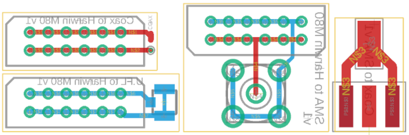

# Mouse Feeder

# 1. Parts List


| Part Description  | Manufacturer | Part ID | Order URL |
| ----------------- | ------------ | ------- | --------- |
| Thin ⌀0.5mm 50Ω coax cable | Alpha Wire  | 9436 WH033 | [DigiKey](https://www.digikey.de/product-detail/en/alpha-wire/9436-WH033/A9436W-10-ND/6003376) |
| Harwin M80 12pos female connector | Harwin  | M80-8871205  | [DigiKey](https://www.digikey.de/product-detail/en/harwin-inc/M80-8871205/952-1231-5-ND/2264218) |
| Harwin M80 12pos male connector | Harwin | M80-8691222 [1] | [DigiKey](https://www.digikey.de/product-detail/en/harwin-inc/M80-8691222/952-2957-ND/2272027) |
| Straight throughhole SMA plug 50Ω male | Amphenol RF | 901-9895-RFX | [DigiKey](https://www.digikey.de/product-detail/en/amphenol-rf/901-9895-RFX/ARFX1229-ND/272187) |
| Straight edgemount SMA plug 50Ω male | Linx Technologies | CONSMA013.062 | [DigiKey](https://www.digikey.de/product-detail/en/linx-technologies-inc/CONSMA013-062/CONSMA013-062-ND/1577228) |
| U.FL SMD Connector | Hirose Electric Co Ltd | U.FL-R-SMT-1(10) | [DigiKey](https://www.digikey.de/product-detail/en/hirose-electric-co-ltd/U-FL-R-SMT-1-10/H11891CT-ND/2504612) |




This is an *emphasis* test

# Headline 

## Smaller Title

* Items
* Second item


| A | B |
| -- | -- |
| Alpha | Beta |

gv

```xml
<root>
<mnode>test<(mnode>
</root>
````
