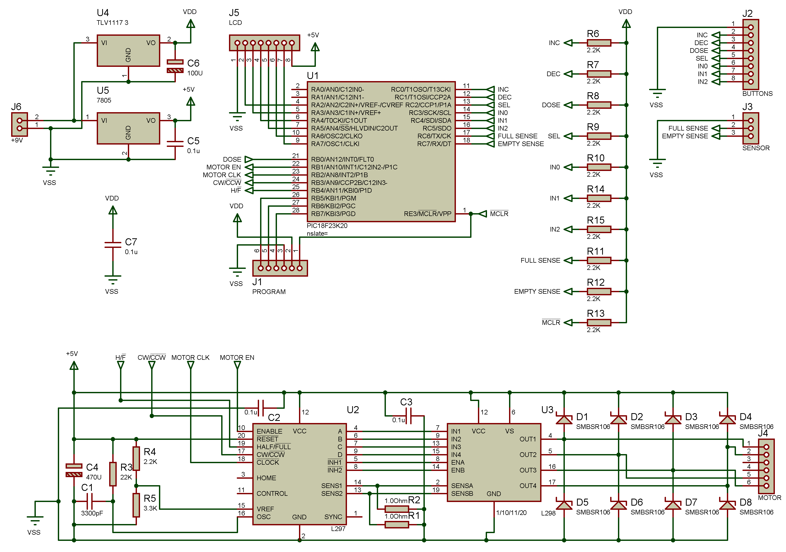
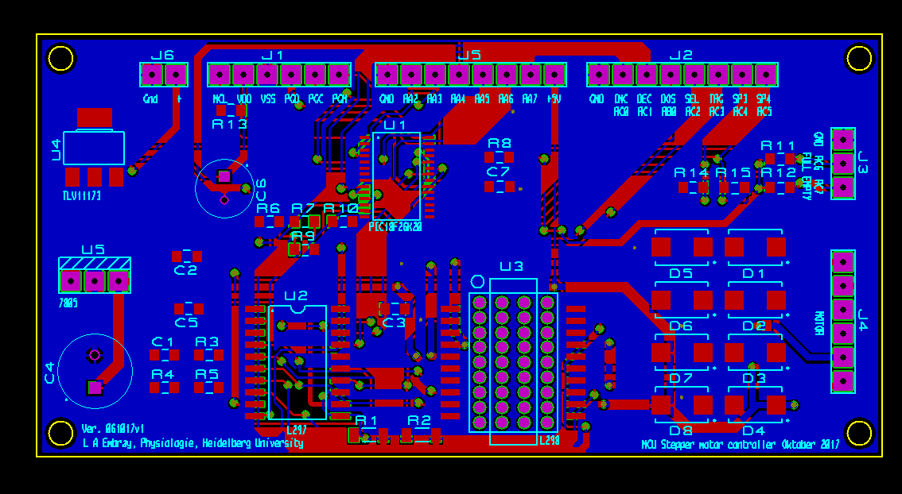
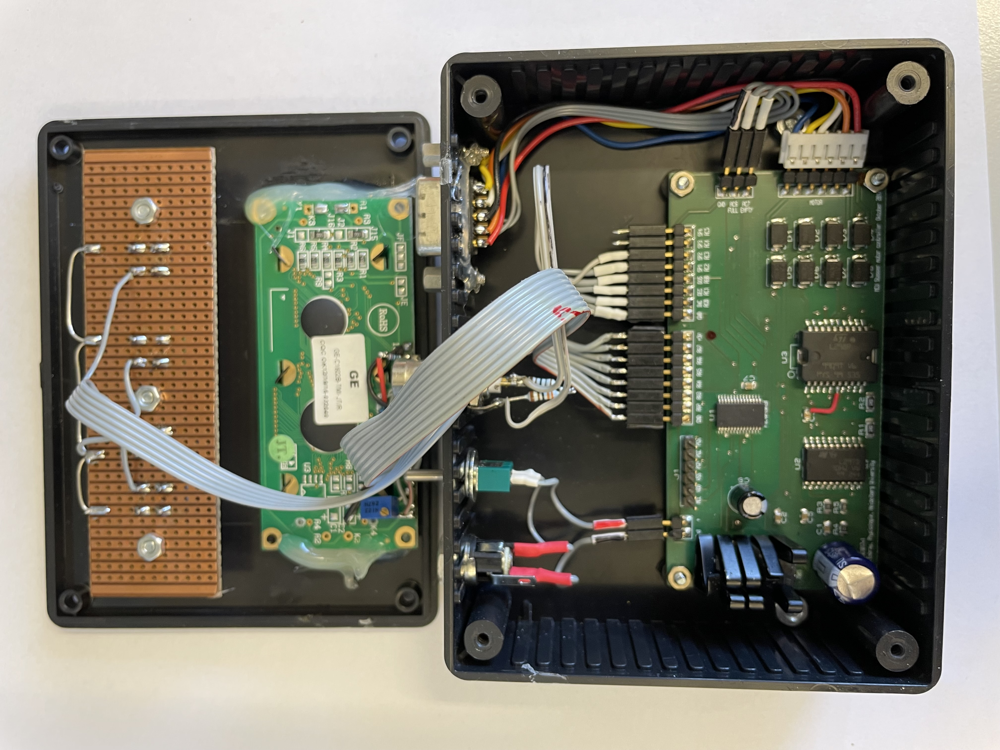
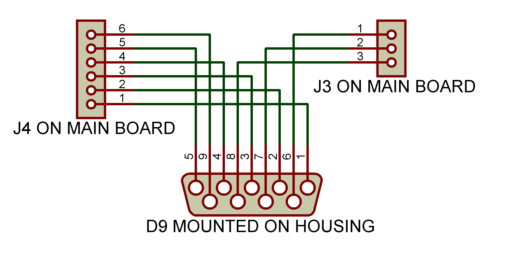
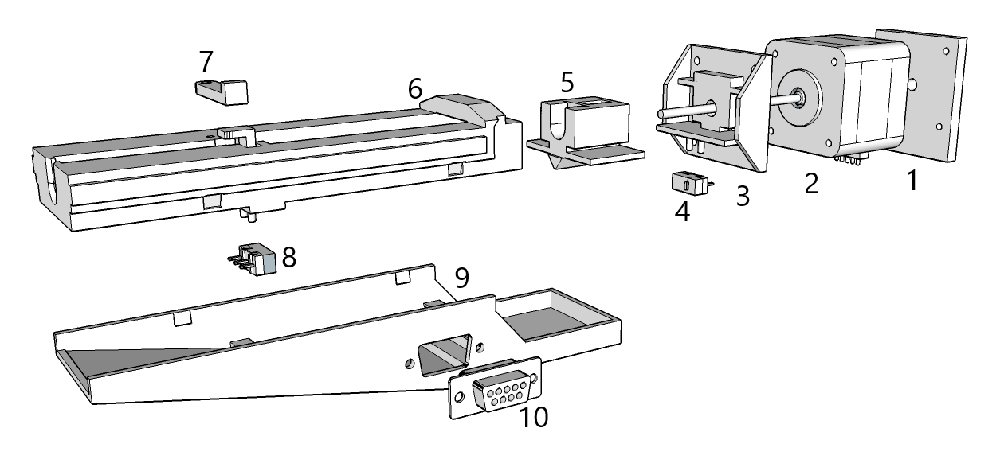
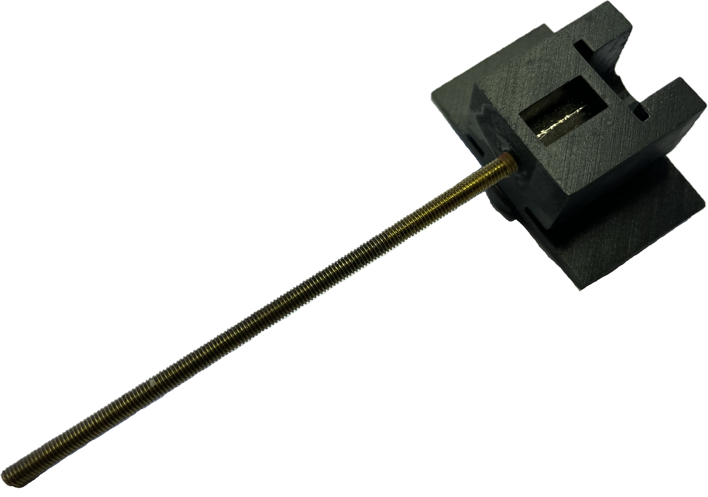
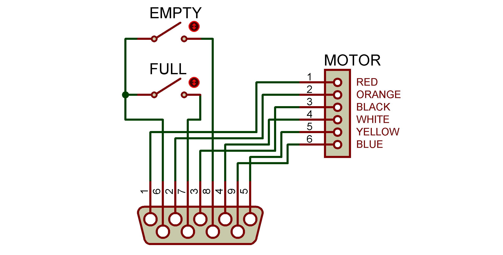
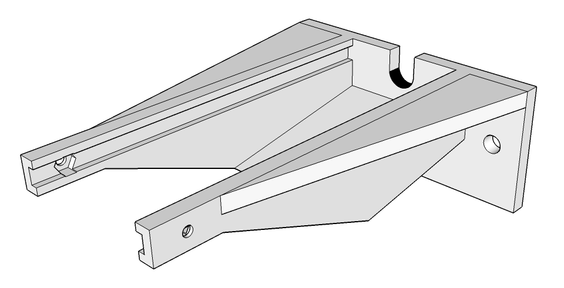
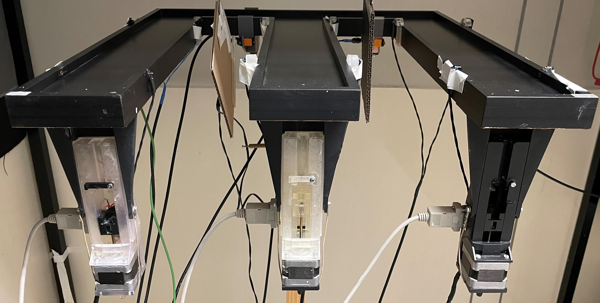

# **Liquid Feeder**

## **Description**

The liquid feeder is designed to administer a user defined preset amount of liquid food to rodents as a reward in behaviour experiments.
The liquid feeder can simply be integrated with any controller that offers a 5V TTL (Transistor-Transistor-Logic) or 3.3V logic output such as a single board computer (Raspberry Pie or Arduino for example)
 or any other microprocessor or logic controller. The feeder has an accuracy far higher than is actually necessary for the application at hand
 but allows the unit to have the possibility of many other applications such as automated administering of chemicals or drugs in a laborotary enviroment.

The unit requires a 9V power supply and a single logic control input with ground, a logic 1 pulse (High) will cause the liquid feeder to administer the user preset amount of liquid food
(Condensed Milk in our case) from the replaceable BD Discardit II 2ml syringe.

The design has two parts, the controller (Main PCB/LCD/Buttons) and the feeder (Mechanical) which are connected together using a standard one-to-one 9pin D type male to female cable.
The main PCB (printed circuit board), LCD and switches are mounted in a small housing allowing remote parameter changes without disturbing the experiment.
The Feeder unit is designed using Google Sketchup and 3D printed using a FormLabs Form 2 SLA (Stereolithografie) 3D printer,
assembly of the mechanical parts is quite labour intensive and modification of the motor for this application requires the use of a lathe.

## **Controller Unit**

## **Parts List**

|Part | Part Description  | Manufacturer | Part ID | Order URL |
| ---- | ----------------- | ------------ | ------- | --------- |
| U1 | Microchip PIC18F23K20 MPU | Microchip  | 666-9860 | [RS Components](https://de.rs-online.com/web/p/mikrocontroller/6669860) |
| U2 |  L297D Stepper Motor Driver SOIC | STMicroelectronics  | 102-3535  | [RS Components](https://de.rs-online.com/web/p/motor-treiber-ics/1023535) |
| U3 | L298P013TR Dual Full Bridge Driver | STMicroelectronics | 880-5308 | [RS Components](https://de.rs-online.com/web/p/motor-treiber-ics/8805308) |
| U4 | SMD 3.3V Regulator TLV111733 | Texas Instruments | 923-3827 | [RS Components](https://de.rs-online.com/web/p/spannungsregler/9233827) |
| U5 |  L78S05CV 5V Regulator TO220 | STMicroelectronics  | 179345  | [Conrad](https://www.conrad.de/de/p/stmicroelectronics-l78s05cv-spannungsregler-linear-typ78-to-220ab-positiv-fest-5-v-2-a-179345.html) |
| D1-8 | Schottkey Diode SK26L | PanJit | 1304995 | [Conrad](https://www.conrad.de/de/p/panjit-schottky-diode-gleichrichter-sk26l-do-214aa-60-v-einzeln-1304995.html) |
| R1,2 | Resistor SMD 1206 1 Ohm 1/2W | Panasonic | 1473248 | [Conrad](https://www.conrad.de/de/p/panasonic-erj-8bqf1r0v-dickschicht-widerstand-1-smd-1206-0-5-w-1-200-ppm-c-1473248.html) |
| R3 | Resistor SMD 0805 22k Ohm 1/8W| Tru Components | 1584677 | [Conrad](https://www.conrad.de/de/p/dickschicht-widerstand-22-k-smd-0805-0-125-w-5-100-ppm-c-tru-components-tc-0805s8j0223t5e203-1-st-1584677.html) |
| R5 | Resistor SMD 0805 3.3k Ohm 1/8W| Tru Components | 1584493 | [Conrad](https://www.conrad.de/de/p/tru-components-tc-0805s8f3301t5e203-dickschicht-widerstand-3-3-k-smd-0805-0-125-w-1-100-ppm-c-1-st-tape-cut-1584493.html) |
| R4,6-13 | Resistor SMD 0805 2.2k Ohm 1/8W| Tru Components | 1584491 | [Conrad](https://www.conrad.de/de/p/tru-components-tc-0805s8f2201t5e203-dickschicht-widerstand-2-2-k-smd-0805-0-125-w-1-100-ppm-c-1-st-tape-cut-1584491.html) |
| C1 | Capacitor SMD 0805 3300pF | Thomsen | 460338 | [Conrad](https://www.conrad.de/de/p/thomsen-keramik-kondensator-smd-0805-3300-pf-50-v-10-1-st-tape-cut-460338.html) |
| C2,3,5,7 | Capacitor SMD 0805 100nF 50V  | Samsung | 454108 | [Conrad](https://www.conrad.de/de/p/samsung-electro-mechanics-cl21b104jbcnnnc-keramik-kondensator-smd-0805-100-nf-50-v-5-4000-st-tape-on-full-reel-454108.html?searchType=SearchRedirect) |
| C4 | Elecrolytic Capacitor 470uF 16V| Yageo | 445373 | [Conrad](https://www.conrad.de/de/p/yageo-se016m0470b3f-0811-elektrolyt-kondensator-radial-bedrahtet-3-5-mm-470-f-16-v-20-x-h-8-mm-x-12-mm-1-st-445373.html) |
| C6 | Elecrolytic Capacitor 100uF 16V| Yageo | 445579 | [Conrad](https://www.conrad.de/de/p/yageo-s5016m0100bzf-0605-elektrolyt-kondensator-radial-bedrahtet-2-5-mm-100-f-16-v-20-x-h-6-mm-x-5-mm-1-st-445579.html) |
| J1-6 | Pin Strip Header 8Pin 3A| BKL Electronic | 742235-VQ | [Conrad](https://www.conrad.com/p/bkl-electronic-10120504-straight-nominal-current-details-3-a-742235) |
| J4 | 90° D9M connector | MH Connectors | 747176-VQ | [Conrad](https://www.conrad.de/de/search.html?search=747176%20-%20VQ) |
| J8 | Low Power connector Socket 2.1mm 5.5mm | BKL Electronic | 733946 | [Conrad](https://www.conrad.com/p/bkl-electronic-072335-low-power-connector-socket-vertical-vertical-55-mm-21-mm-1-pcs-733946) |
| J9 | BNC Connector Socket | TRU COMPONENTS | 1564888 | [Conrad](https://www.conrad.com/p/tru-components-740632-bnc-connector-socket-vertical-vertical-50-1-pcs-1564888) |
| Box | ABS Case 121x94x34mm  | Hammond | 493-6032 | [RS Components](https://de.rs-online.com/web/p/universalgehause/4936032) |
| LCD | LCD 16x2 White on Blue  | Gleichmann | 183045 | [Conrad](https://www.conrad.com/p/gleichmann-led-component-white-blue-w-x-h-x-d-80-x-36-x-132-mm-ge-c1602b-tmi-jtr-183045) |
| SW1-4 | Momentary Switch TC-D6SW  | TRU COMPONENTS | 2238782 | [Conrad](https://www.conrad.de/de/p/tru-components-tc-d6sw-impulstaster-35-v-dc-0-01-a-tastend-1-st-1589415.html) |
| PCB | Strip Board Paper/Copper 2.54mm | Rademacher | 529531-62 | [Conrad](https://www.conrad.de/de/p/rademacher-wr-typ-710-2-platine-hartpapier-l-x-b-100-mm-x-75-mm-35-m-rastermass-2-54-mm-inhalt-1-st-529531.html) |
| PSU | Plugin Powersupply 9V 2A  | Mean Well | 1837961 | [Conrad](https://www.conrad.de/de/p/mean-well-gsm18e09-p1j-steckernetzteil-festspannung-9-v-dc-2-a-18-w-1837961.html#productTechData) |

 **Liquid Feeder Schematic**  

 **Liquid Feeder PCB**

## **1. PCB Assembly**

PCB Gerber files are supplied allowing production and ordering, the origional Proteus design file is also supplied incase any modifications for specific requirements are necessary.
All components of the PCB are mounted by hand and special attention should be applied to the motor driver (U3) as the underside of the component is used as a heat sink and must be soldered to the PCB,
this is done from the reverse side of the PCB using the through holes integrated on the PCB design.

## **2. LCD Preparation**

The LCD requires that a few jumpers and components are added directly to the LCD module, this reduces the amount of connections between the main PCB and the LCD,
the schematic below shows the necessary modifications.
 **LCD Schematic**

 **LCD Modification**: Shows how components are directly mounted to LCD module.

## **3. Controller assembly**

All components are mounted in a plastic housing and necessary holes for the the LCD, switches and connectors are drilled accordingly.
 **Front Panel**: Showing LCD unit and the four buttons for operation.

 **Back Panel**: Showing connection to feeder unit(D9), trigger input(BNC), on/off switch and power connector(low power connector).

**Switches Schematic**: Showing connections between front panel switches and main PCB.

 **Button Mounting**: A peice of Strip board is used to mount the switches inside the case.

**LCD/Buttons**: The LCD is simply held in place with hot glue.

 **Finished Controller**: The main PCB is mounted inside the housing.

**Controller wiring** From main PCB to D9 connector.

## **4. Programming**

The Microprocessor must be programmed with the included program, this is performed using a Microchip Pickit 3 In-Circuit Debugger/Programmer and the Microchip MPLAB IDE X software,
once the included project is added to the programming software the PicKit programmer can be plugged directly into the J1 on the main PCB and the program uploaded to the microprocessor.

## **Feeder unit**

## **Feeder Parts List**

|Part | Part Description  | Manufacturer | Part ID | Order URL |
| ---- | ----------------- | ------------ | ------- | --------- |
| M1 | Stepper Motor 0.25Nm 0.6A | EMIS | 198398 | [Conrad](https://www.conrad.de/de/p/emis-schrittmotor-103-h5205-0351-103-h5205-0351-0-25-nm-0-6-a-wellen-durchmesser-5-mm-198398.html) |
| SW5,6 | Microswitch125V AC 3A| Hartmann | 704713 | [Conrad](https://www.conrad.de/de/p/hartmann-mikroschalter-microhart-125-v-ac-3-a-1-x-ein-ein-tastend-1-st-704713.html) |
| Rod | Threaded Rod M3 500mm  | REELY | 297984 | [Conrad](https://www.conrad.de/de/p/reely-297984-gewindestange-m3-500-mm-messing-1-st-297984.html) |
| Spacer | 10mm M3 Brass Spacer  | Elektromechanik Schaefer GmbH| 526630 | [Conrad](https://www.conrad.com/p/603510-b6-spacer-l-10-mm-m3-m3-brass-1-pcs-526630) |
| J10 | D-Sub Connector 9pin Female  | Molex | 2447529 | [Conrad](https://www.conrad.de/de/p/molex-1727040168-fct-standard-density-d-sub-connector-female-straight-solder-cup-gold-plating-200-mating-cycles-15-2447529.html) |
| Cable | D-Sub9 Cable M-F 2M  | Pheonix Contact | 673801 | [Conrad](https://www.conrad.de/de/p/phoenix-contact-seriell-parallel-anschlusskabel-1x-d-sub-buchse-15pol-1x-d-sub-stecker-15pol-2-00-m-weiss-673801.html) |
| Wire | Jumper Wire 1x0.2mm  | Tru Components | 1567899 | [Conrad](https://www.conrad.de/de/p/tru-components-1567899-schaltdraht-yv-1-x-0-20-mm-schwarz-100-m-1567899.html) |

## **1. Parts Preparation**

The motor (M1) has an output shaft which requires modification, this is best performed on a lathe, The motor should be carefully dismantled and the rotor removed.

1. Using a lathe the shaft of the rotor should be shortened to the same length as the shorter side of the rotor meaning the assembled motor has no protruding shaft from either side.
2. Using a lathe the complete length of the rotor/shaft should be drilled out using a 2.5mm drill bit mounted in the tailstock,
it is very important that the drilling is centered correctly for smooth operation and this can be achieved by using a centre drill first as a guide before the 2.5mm drill bit.
3. Using a lathe an M3 thread must be cut within the hole drilled in step two, the M3 Tap should be mounted in the tailstock and the tailstock should be freely moving on the guide ways,
by turning the main spindle chuck holding the rotor by hand the thread can be accurately cut through the entire length of the rotor shaft.
4. The four screws holding the motor together should be replaced with M3x35 screws or shortened to 35mm length.
5. The motor should now be reassembled paying particular care to making sure there is no small pieces of metal swarf trapped within and all parts are sufficiently clean,
any dirt or swarf will cause the motor to jam. The motor cover (1) should be mounted to the motor using the replacement M3x35 screws.

A piece of brass M3 threaded rod should be cut to a length of 83mm and the threads cleaned on each end.

Once all parts are 3D printed a small amount of cleaning/trimming and sanding is required to allow the slider (5)
to move freely within the main body (6) and all parts to accurately fit together without force. The following drawing shows all parts for assembly.

 **Complete Assembly**

## **2. Assembly of parts**

The 10mm M3 spacer is inserted into the slot on the slider (5) so that the internal thread can be seen through the hole,
the threaded brass rod should then be inserted into the hole and screwed into the inserted spacer, it is necessary to apply some thread lock to stop the threaded rod from unscrewing itself during operation.

 **Assembled slider**

The slider (5) can now be inserted into the main body (6), be sure that the slider is free moving in its guide ways for the full extent of its movement.
A small amount of general purpose grease is recommended to be applied to the guideway and slider as well as the threaded rod.

The motor mount (3) can now be mounted to the body (6) and secured using two countersunk 3x10mm self tapping screws.

With the slider (6) retracted so that the threaded rod is at its longest the motor (2) can be screwed onto the threaded rod as far as it will go before touching the motor mount (3),
the motor (2) can now be pushed until it is seated with the motor mount (3) and secured using four M3x10 screws.

The syringe lock (7) can be secured to the body (6) using a M3x10 screw,
this should not be too tight as it is required to rotate and either lock the syringe in place or unlock the syringe for replacement or cleaning.

The two end stop microswitches (4,8) can be slid on to the mounting guide pins, care must be taken doing this as the guide pins are quite fragile.

The D9 connector (9) can be mounted into the back cover (10).

Wires should be connected to the two microswitches (4,8) and connected to the D9 connector as shown in the wiring diagram below.
The wires from the motor should be shortened and also connected to D9 connector as shown in the wiring diagram.

**Feeder wiring schematic:** showing connection between motor and empty/full switches to D9 male connector.

The back cover can now be fitted in place paying close attention that any wires are not in the path of the slider.

## **Mounts**

Two mounts have been designed for our applications and the sketchup drawings included,
the drawings can easily be modified to suit other requirements and fittings with the majority of the work already done.

The mount shown below fits in place of the motor cover (1) and then allows the feeder to be mounted on a moveable stand.

**Mount to fit on stand (fits in place of standard motor cover)**

The second mount is designed for a permanent position on our behavour setup,
once the mount has been fixed to the setup the feeder can be simply slid in and out of the mount making syringe replacement, refilling and cleaning very simple.

**Mount (to fit our application)**: This mounting system allows the feeder to easily be removed for cleaning.

**Wire Clip**: A simple wire clip allows the feeder to easily be removed for cleaning.

**Setup**: For our application three feeder units are mounted vertically.

**Controllers**: Three controllers are mounted on the wall by using magnets and a sheet of steel mounted to the wall.

## **Operation**

The controller and feeder are connected using a standard D9 male to female serial cable,
once the power supply is connected the LCD will illuminate and the program will initiate. A simple menu structure for the control of operation is shown below.

 **First Menu**: When **INC (RUN)** is pressed the unit will enter **RUN** mode.

 **Run Mode Display**: This
shows the unit is in **RUN** mode and is ready for operation and waiting for an external trigger.
Pressing **DOSE** at any time will administer the set quantity. Pressing the **SEL (EXIT)** button will exit **RUN** mode and return to the **First Menu**.

 **Setup Menu**:
When **DEC (SETUP)** is pressed on the **First Menu** the program enters **SETUP** mode.

 **Set Quantity**: When **INC (SET AMOUNT)** is pressed in the **SETUP Menu** the quantity to be administered can be set using the **INC/DEC** buttons,
pressing the **SEL** button will accept this new quantity and save it to memory while also exiting the **QUANTITY** Function.
The new quantity is saved in SRAM memory and will be automatically recalled even after a power cycle,  units are in ul(micro litres)

 **EMPTY/FILL**: When **DEC (EMPTY/FILL)** is pressed in the **Setup Menu** the unit is able to fill or empty the syringe of whatever liquid is being used
(in our case condensed milk), by pressing **INC (FILL)** the syringe will be fully retracted filling the syringe with liquid,
by pressing **DEC (EMPTY)** the syringe will be fully protracted emptying the contents of the syringe. Pressing the **SEL** button will stop either process and return to the previous menu.
