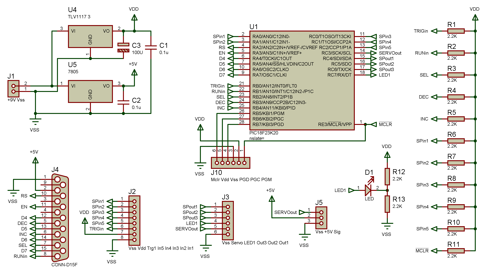
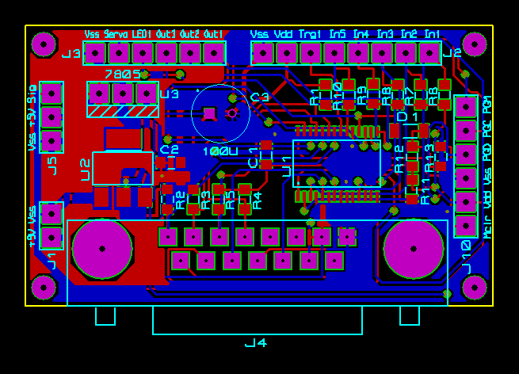
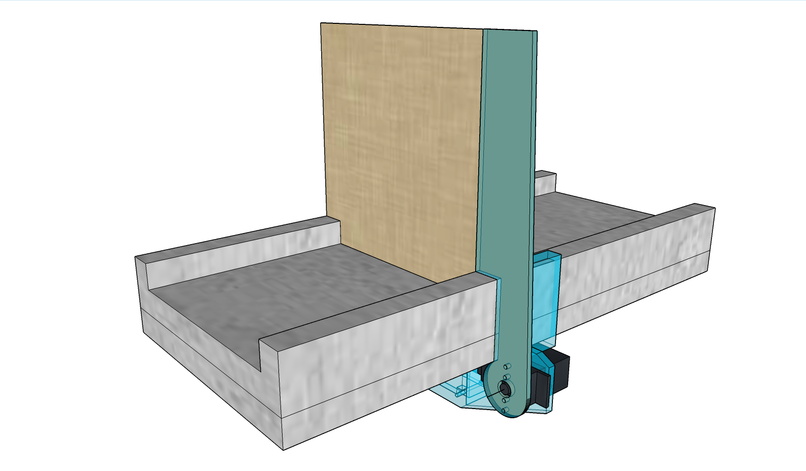

# TTL Controllable Gate
# 1. Description
The TTL Controllable Gate is designed to open and close a mechanical gate for use in rodent behaviour experiments, the gate can simply be operated from any controller that offers a TTL (Transistor-Transistor-Logic) or 3.3V logic output such as a single board computer (Raspberry Pie or Arduino for example) or any microprocessor or logic controller.

The unit requires a 9V power supply and a single logic control input and ground reference, a logic 1 (High) will cause the servo motor to open the gate and a logic 0 (Low) will cause the servo motor to close the gate.

Due to the controllers ability to control any standard sized RC (Radio Controlled) servo the controller could be adapted for many different applications where a preset movement range is to be controlled by a single TTL input for example closing and opening a valve.
The range of movement is set as a minimum and maximum number in the program of the microprocessor and must be set to the correct range of movement before operation.

# 2. Parts List

|Part | Part Description  | Manufacturer | Part ID | Order URL |
| ---- | ----------------- | ------------ | ------- | --------- |
| U1 | Microchip PIC18F23K20 MPU | Texas Instruments  | 812261982 | [Conrad](https://www.conrad.de/de/p/high-speed-cmos-hex-inverter-schmitt-trigger-dip-14-812261982.html) |
| U2 |  7805 5V Regulator | Kingbright  | 154434  | [Conrad](https://www.conrad.de/de/p/kingbright-l-53f3bt-ir-emitter-940-nm-30-5-mm-radial-bedrahtet-154434.html) |
| U3 | SMD 3.3V Regulator | Kingbright | 154527 | [Conrad](https://www.conrad.de/de/p/kingbright-fototransistor-5-mm-1100-nm-l-53p3c-154527.html) |
| D1 | HLMP-3301 Red 5 mm LED | Broadcom | 180620-62 | [Conrad](https://www.conrad.de/de/p/broadcom-hlmp-3301-led-bedrahtet-rot-rund-5-mm-7-mcd-60-10-ma-1-9-v-180620.html) |
| R1-R13 | SMD Carbon Film  2.2k Ohm | Yageo | 1417661-62 | [Conrad](https://www.conrad.de/de/p/yageo-cfr-25jt-52-12r-kohleschicht-widerstand-12-axial-bedrahtet-0207-0-25-w-5-1-st-1417661.html) |
| C1-C2 | SMD Capacitor 100nF | Yageo | 1417697-62 | [Conrad](https://www.conrad.de/de/p/yageo-cfr-25jt-52-10k-kohleschicht-widerstand-10-k-axial-bedrahtet-0207-0-25-w-5-1-st-1417697.html) |
| C3 | Elecrolytic Capacitor 100uF 16V| Rademacher | 529531-62 | [Conrad](https://www.conrad.de/de/p/rademacher-wr-typ-710-2-platine-hartpapier-l-x-b-100-mm-x-75-mm-35-m-rastermass-2-54-mm-inhalt-1-st-529531.html) |
| J1,2,3,5,10 | Pin Strip Header 3A| BKL Electronic | 742235-VQ | [Conrad](https://www.conrad.com/p/bkl-electronic-10120504-straight-nominal-current-details-3-a-742235) |
| J4 | 90° D15F connector | MH Connectors | 747176-VQ | [Conrad](https://www.conrad.de/de/search.html?search=747176%20-%20VQ) |
| 2x Screw | Cylinder Screw1.4x5 DIN84 S/Steel | MAYHER | 806469312-VQ | [Conrad](https://www.conrad.de/de/p/din-84-1-4305-m-1-4-x-5-rostfrei-a-1-s-806469312.html) |

Schematic of maze gate controller

PCB Layout of maze gate controller

# 3. Functionality

All servos use a simple three wire connector containing power (Normally 4.8V to 6V), Ground and a control wire. To be able to control the movement of a RC Servo a series of pulses must be sent to the servos control wire normally at a rate of fifty times a second (50Hz) although servos will also react to just a few pulses per second if fast reaction time is not of importance, the pulses sent to the servo should range from approximately 1mS (Minimum Position) to 2mS (Maximum Position) known as PWM (Pulse Width Modulation), some servos have an extended range and can operate outside these limits and some prefer to have a range of 1.1mS to 1.9mS, pulses outside of the range of the servos specification will result in the servo not moving at all, this is helpful to know when setting the range of motion. 

The schematic comprises of a simple voltage regulation circuit offering 5V for powering the servo and 3.3V for powering the microprocessor, a microprocessor which is programmed to output the correct PWM signal to control the servo and an LED to show the current state of the servo position as well as blinking when first powered up to indicate readiness for operation.

A header of 6 pins is included for simple direct connection of the Microchip PIC programmer.
J4 is not required for this application and is only present for future requirements. 

More headers are provided as the microcontroller has many available unused pins that can be assigned as an input or output, this means the designed PCB (Printed Circuit Board) can be used for many other controlling purpose of future projects, in this case only one input and one output are utilised.
In this design only one servo per unit is controlled but due to the many spare IO (Input/Output) connections available more servos could be controlled.

The programing of the microprocessor has been kept simple and outputs only the new servo position causing the servo to move at full speed to the required position, with additional programming variable speed of movement could easily be introduced by gradually increasing/decreasing the length of the pulse sent to the servo. Programming is done using the Microchip MPLAB X IDE programming software which is required to program the Microchip family of MPUs

A housing for the PCB and servo was designed and printed using a FormLabs Form 2 SLA (Stereolithografie) 3D printer. The design allows the gate to be simply placed anywhere on the track of our behavour setup, using Google Sketchup this drawing can be easily modified to fit personal requirements and other mounting options.

Printed parts of the maze gate

The above drawing shows the designed parts to be 3D printed and then assembled, as can be seen an arm has been created to attach the door to the servo, the door is made from cardboard as this is light and does not apply much load to the servo motor whilst also being cheap and disposable to aid cleaning of the setup, the doors shape is bespoke to the track it will be mounted upon and can be modified to fit any further application.

Gate mounted to track

